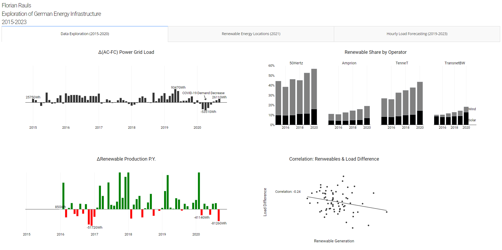
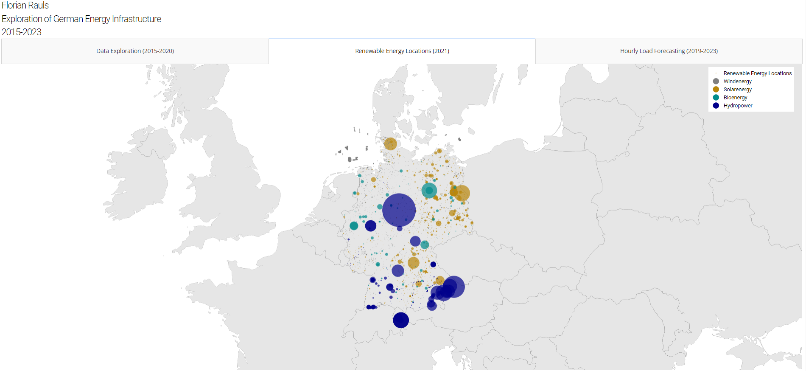
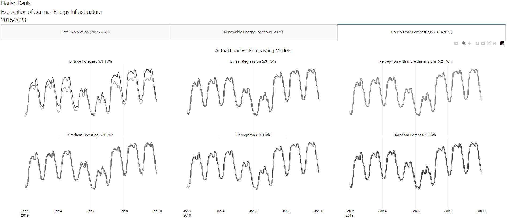

# IBCS-conform German Energy Generation Dashboard ([Link to Demo](https://german-energy-grid-dashboard-ibcs.onrender.com))
## Overview
This repository is a work in progress to create an International Business Communications Conform (https://www.ibcs.com/de/) conform dashboard giving an overview of German Energy Generation.

## Features
N/A

## Installation and Usage
N/A

## Data Sources
Open Power System Data. 2020. Data Package Time series. Version 2020-10-06. https://doi.org/10.25832/time_series/2020-10-06. (Primary data from various sources, for a complete list see URL)
(https://data.open-power-system-data.org/time_series/)

Manske, D., & Schmiedt, J. (2023). Geo-locations and System Data of Renewable Energy Installations in Germany (Version V20230420) [Data set]. Zenodo. https://doi.org/10.5281/zenodo.8188601 (https://zenodo.org/records/8188601)

https://github.com/leakyMirror/map-of-europe/blob/master/GeoJSON/europe.geojson
